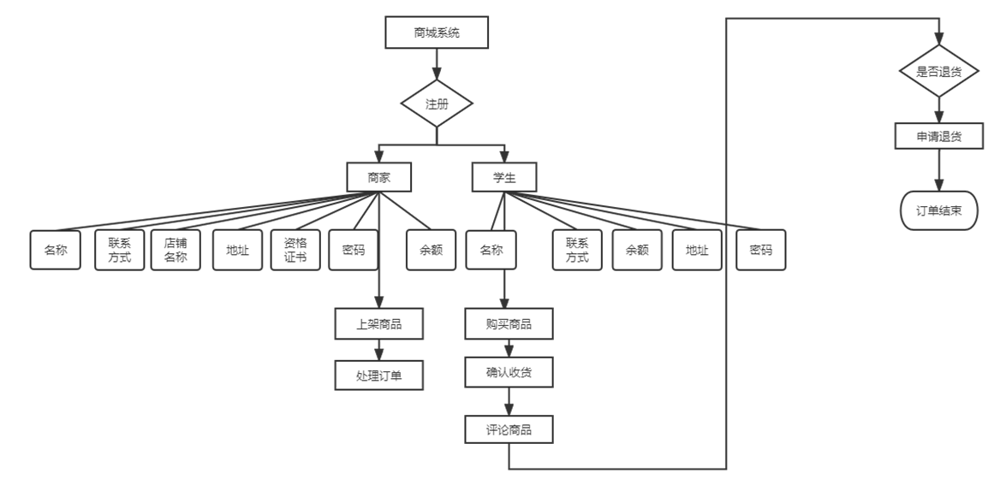

# 基于推荐算法开发商城交易网站

## 可行性分析报告
# 

---

### 状态与版本信息
- 文件状态：
- 文件标识：DOC20220920
- 当前版本：1.0.0
- 作者：
    - 王旭  
       
    - 王亚伟  
       
- 团队：无言以队
### 完成日期：2022年9月20日

## 一、可行性研究前提

### 1. 要求   
1.1 功能：  
   - 用户层面：实现注册、登录、商品浏览、商品购买、订单状态查询、余额充值等功能  
   - 商家层面：实现注册、登录、商品上架和下架、余额充值、商品浏览等功能  
   - 管理员层面：登录后台管理系统，并在后台管理系统实现以下功能：对商家和管理员的账户状态进行更改、审核商家和用户提交的注册信息、实现商品的上架和下架、更改用户和商家的信息、更改自身密码和添加新的管理员  
   - 后端算法要求：连接数据库，设计推荐算法实现商品推荐，对前端系统传来的请求进行正确处理并反馈结果  

1.2 兼容性：
    支持个人计算网页访问

1.3 性能：
    界面美观、功能齐全、按钮跳转无错误、所支持用户数量应大于1000名

1.4 完成期限：2个月

### 2.目标
- 人力与设备费用的提高
- 功能反馈速度提高
- 算法实现的商品推荐最大限度匹配用户喜好
- 管理信息服务的改进
- 算法系统的改进
- 项目参与人员效率的提高

### 3.条件假定和限制

- 所建议系统的运行寿命的最小值：5年

- 进行系统方案选择比较的时间：14天

- 法律和政策方面的限制：遵守IT工程师基本道德素养、禁止触犯中华人民共和国《宪法》等法律条文相关之规定

- 硬件、软件、运行环境和开发环境方面的条件和限制：可在当前市场主流浏览器上正常运行，支持PC端网页访问

- 系统投入使用的最晚时间：2022年11月

### 4.进行可行性研究的方法

- 投资必要性：主要根据市场调查及预测的结果，并对相关产业政策以及项目投资建设的必要性进行调研，在投资必要性的论证上，一是要做好投资环境的分析，对构成投资环境的各种要素进行全面的分析论证，二是要做好市场研究，包括市场供求预测、竞争力分析、价格分析、市场细分、定位及营销策略论证。

- 技术可行性：主要从项目实施的技术角度，合理设计技术方案，并进行比选和评价。

- 财务可行性：从项目投资者的角度，设计合理财务方案，从企业理财的角度进行资本预算，评价项目的财务盈利能力，进行投资决策，并从融资主体的角度评价股东投资收益、现金流量计划及债务清偿能力。

- 组织可行性：制定合理的项目实施进度计划、设计合理的组织机构、选择经验丰富的管理人员、建立良好的协作关系、制定合适的培训计划等，保证项目顺利执行

- 经济可行性：主要从资源配置的角度衡量项目的价值，评价项目在实现区域经济发展目标、有效配置经济资源、增加供应、创造就业、提高人民生活等方面的效益

### 5.评价尺度

在系统评价过程中，主要依据订单成交数、用户和商家增长速度，系统成交额、购买和订单处理流程执行速度、用户和商家评价内容、用户成交量和浏览量之比等

## 二、对现有系统的分析
现有系统可参照淘宝网或京东网，其上线时间较长，系统结构完善，功能齐全，主要面对用户和商家，对商品进行分类，支持浏览、购买、退货、评论等功能，已然成为当今最流行的两款商城系统。  

2.1 流程分析

商家首先注册账户，通过注册后提交运营资质供平台审核，审核通过后方可上架商品（输入商品的名称、分类、尺寸、规格、库存、商品描述图等），并实时更改商品库存；用户提交注册并成功登录，可浏览商品信息，并选择商品进行购买

2.2 局限性

- 由于入门门槛低，经营同类产品的商家多，提供的价格搜索，损害了很多保质保量的商家的利益

- 严格划分了服务收费的层级，造成很多商家入门后，造成是否收回成本与继续投资服务的矛盾

- 卖家可自由删除用户的评论

- 依托现有的市场的庞大用户群，积极引进厂家，大品牌等进驻商城，直接与个体商户或小型商户形成直接竞争，降低了小商家的竞争力造成很多价值商户注销账户

2.3 工作负荷

存储商家信息、用户信息、商品信息、订单信息和管理员信息，可对所有信息进行检索，支持多用户同时访问，商家拥有多个商品，用户可浏览不同商品。

## 三、所建议的系统地说明

3.1 说明 

本报告所要开发的基于推荐算法的商城系统主要面向用户，系统会根据用户的浏览记录，根据浏览次数和购买次数，更改用户登陆后查看的商品顺序，根据用户的喜好，推荐相似种类商品。

3.2 改进之处

系统主要实现推荐算法，对支付、订单等功能进行淡化处理，同时推荐算法的设计具有一定时效性，得根据用户体验和实际效果，逐步改进

3.3 影响

本系统投入使用后，将极大满足用户的购物需求，高效利用现有资源，同时将提高系统的普及率和使用率，获取更多用户的支持，帮助商家提高商品销量，推动电子商务和经济发展。

## 四、可选择的其他方案
### 可选择的系统方案1

 - 前后端分离的不基于推荐算法的网上购物平台

 - 主要包括前端，后台人员管理，商品管理，商品信息管理等。
### 可选择的系统方案2

 - 前后端不分离的基于推荐算法的网上购物平台

 - 主要包括商城页面，商品页面，商品的状态信息，人员的状态信息，人员管理等。

## 五、投资效益可行性分析

5.1 支出  
雇佣开发人员、设备维护

5.2 基本建设投资  
笔记本电脑、数据库管理软件、代码开发软件、数据通信设备等

5.3 非一次性支出

- 设备的维护费用、电力费用

- 域名维护和服务器访问费用

- 数据通讯方面的租金和维护费用

- 人员的酬金和奖金等

- 房屋、空间使用开支

- 公用设施开支

- 其他日常活动支出

5.4 一次性收益

- 开支的缩减包括改进了的系统的运行所引起的开支所见，如资源要求的减少，运行效率的改进，数据进入、存贮和恢复技术的改进，系统性能的可监控，软件的转换和优化，数据压缩技术的采用，处理的集中化、分布化等

- 价值的增升包括由于一个应用系统的使用价值的增升所引起的收益，如资源利用的改进，管理和运行效率的改进以及出错率的减少

5.5 不可定量的收益

- 服务改进，提高了员工的工作积极性

- 出错率减少，减少了运行风险

- 信息更新及时，减少了决策的准确率

- 信息更新及时，提高了决策的准确率

- 开发小组管理更加透明，人性化

5.6 收益/投资比
系统的开发初期投入较高，需进行设备采购和场所租赁，但当系统开发完成后，所需的投资将适当减少，仅需对设备进行维护和跟新，收益/投资比约为5。

5.6 投资回收周期
投资回收周期为1年

## 六、时间和资源可行性分析
### 时间可行性
 - 本次项目期限为70天左右，每周二早上8点到下午五点为固定的开发时间段，组内11人各司其职，分工明确。

 - 团队每周开一次例会保证项目开发的高效进行。

 - 保证每周日完成本周的工作任务。
### 资源可行性
#### 人力资源方面
 - 项目经理1名

 - 需求分析师2名

 - 软件工程师2名

 - 系统分析师1名

 - 测试工程师1名

 - 系统架构师1名

 - 美术工程师1名。
#### 资金方面
##### 基本资金
 - PC机11台

 - 开发工具支出资金

 - 数据库管理工具资金

 - 安全与保密协议资金
##### 其他支出资金
 - 系统研究资金

 - 开发计划与衡量基准研究资金

 - 数据库建立支出资金

 - 检查费用和技术性管理资金

 - 培训人员支出费用
## 七、技术可行性分析
 - 前端开发采用vue，后端开发使用springboot+mybaits-plus,数据库采用mysql，预期可以准确的开发出系统。

 - 开发小组成员大一到大三有着许多项目开发经验和代码量，拥有一定的经验

 - 小组成员各司其职，有效沟通
## 八、社会因素方面的可行性分析
### 1.市场分析
 - 近些年随着互联网行业的快速发展以及直播行业与电商行业的迅速崛起以及疫情等多方面原因，网上购物平台在当下是许多人的不二选择。现如今网上购物平台层出不群，
几乎涵盖了生活的方方面面，包括吃穿住行都可以在网络上统统搞定。
 - 追根溯源，电子商务是于九十年代出，在欧美兴起的一种全新的商业交易模式，它实现了交易的无纸化、
效率化，自动化表现出了网络最具魅力的地方，快速的交易系统，地理界线的模糊，这所有的一切也对推动传统商业模式向网络模式变革起了促进作用，随着电子商务，
尤其是网上购物发展，商品流通基础设施和配套行业的重点将会对中国商品流通领域和整个经济发展带来种种有利的影响。
### 2.政策分析
 - 在经济全球一体化的国际背景下继续扩大国内流通领域对外开放是当前的主要政策，所以在疫情等一些客观因素的影响下，许多的跨国企业都需要在网上进行交易和商品互通。

 - 法律分析国家对电子商务企业的政策 通过税收优惠政策，鼓励互联网创业法律依据中华人民共和国税收征收管理法第一条 为了加强税收征收管理，规范税收征收和缴纳行为，保障国家税收收入，保护纳税人的合法权益，促进经济 

 - 意见指出，支持互联网企业依法合规设立互联网支付机构网络借贷平台股权众筹融资平台网络金融产品销售平台，建立服务实体经济的多层次金融服务体系，更好地满足中小微企业和个人投融资需.

### 3.竞争实力分析
 - 近些年互联网产业虽然发展速度放缓但是电子商务领域大放异彩以及5G技术产业大力发展的相互作用，民众线上线下以线上购物为准。

 - 随着电商平台和直播行业的携手发展，网上交易系统的类型层出不群，因此突出与其他网络购物平台的不同点是异常重要的。我们这款网络购物平台是基于推荐算法的交易平台。

 - 平台可以根据用户搜索浏览访问下单商品的频率来进行分类筛选，生成每个用户的模型。使用推荐算法可以让用户在众多商品里尽可能多的浏览自己心仪的商品，在整个搜索浏览下单过程中节约大量时间。  

### 4.知识产权分析
#### 知识产权的合法性和稳定性
 - 主要专注于商场推荐算法的分析与设计，围绕算法特征设计。

 - 关键技术是使用vue前端加mybaits-plus以及数据库mysql。
#### 作用与影响
 - 小组以技术为中心，在研发阶段和系统构造阶段提升和注重知识产权的领导力。
## 九、结论

通过本报告的详细论证和各方面的综合考量，我们认为本系统的可开发性较高，市场对于同类产品的需求较大，本系统旨在利用推荐算法，根据用户的喜好为用户提供最佳商品选择；系统相关实现流程清晰明确，相关人员技术水平也已达到开发要求，在完成所要求的功能之后，开发人员仍可根据自身情况，对系统功能进行拓展。此外本系统的推行，将有利于经济发展，帮助商家提高销量，创造营收。

