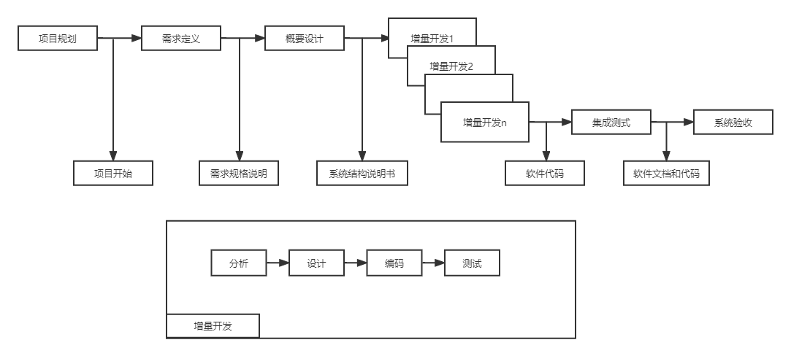
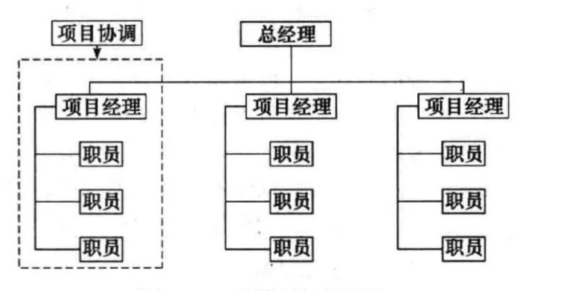
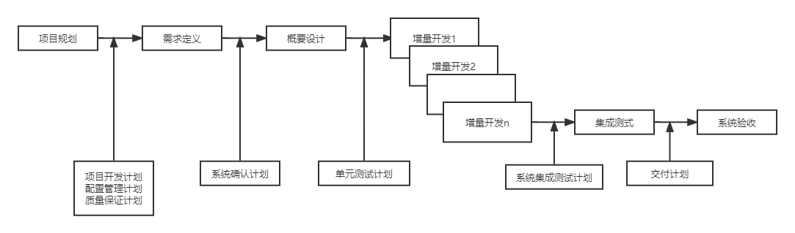
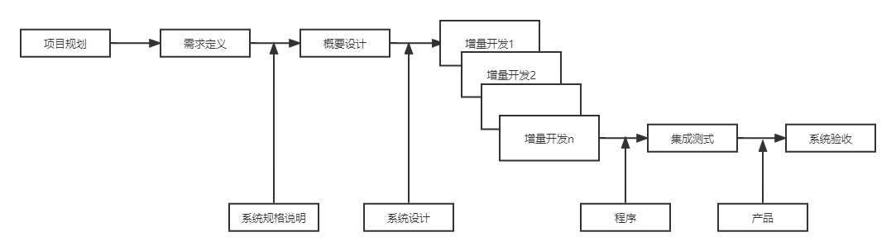
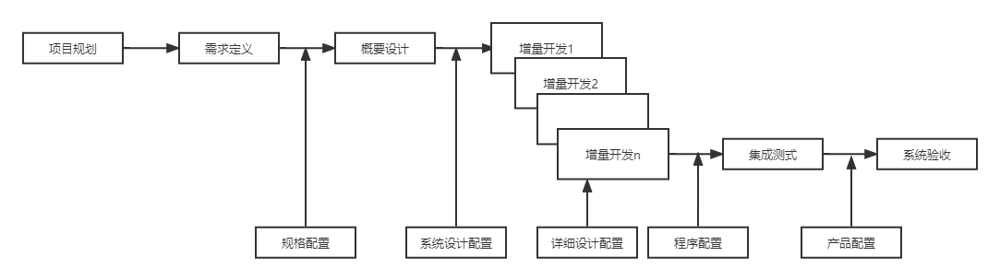
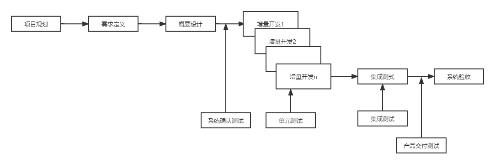
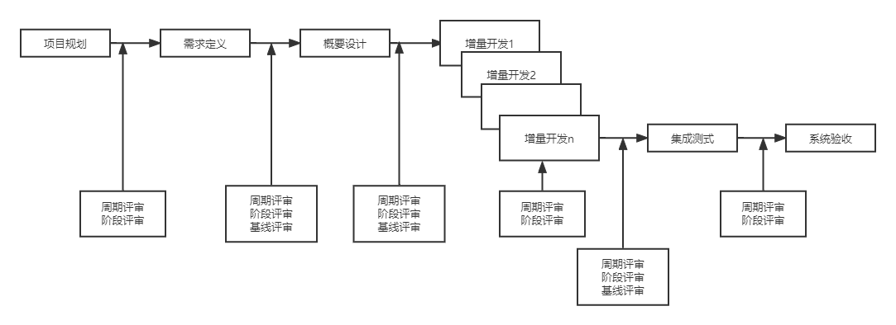

# 基于推荐算法的商城购物网站软件过程定义

##### 文件状态：尚未发布

##### 文件标识：WYYD-MAIL-SPD-V1.0
##### 当前版本：1.0

##### 作者：
* 姓名：王恬
* 学号：2019011409
* 团队：无言以队

##### 完成日期：2022/09/20

##### 版本更新信息：

| 版本号 |  更新时间  |   更新信息   | 更新人员 |
| :----: | :--------: | :----------: | :------: |
|  v1.0  | 2022/09/20 | 初步编写文档 |   王恬   |
|  v1.1  | 2022/10/04 | 修改文件名 |   王恬   |

### 1、引言

#### 1.1 使用人员：

* 项目管理人员：王飞龙
* 配置管理人员：王飞龙、张雨
* 质量保证人员：郎海峰、张阳
* 项目开发人员：那婷婷、叶莹

#### 1.2 编写目的

该文档是为了给用户提供的系统开发项目建立一个开发模式和开发过程规范，其主要目的是：

* 定义系统开发生存周期
* 明确生存周期的各个阶段
* 确认开发基线
* 确认各阶段相关人员的任务

本项目使用本文档定义的通用或称进行软件的过程管理，它为项目配置管理人员，质量保证人员和项目开发人员提供了一个完善的过程框架，从而便于项目相关人员在项目需求、交付产品和开发进展方面进行交流沟通。

### 2、软件开发生存期

#### 2.1 软件开发模型

采用增量式开发模型。

#### 2.2 软件项目组织

采用的是职能型组织结构。

### 3、阶段定义

#### 3.1 阶段说明

##### 项目规划

| 参与人员 | 王飞龙、张雨、王恬、那婷婷、叶莹、郎海峰、张阳、王旭、王亚伟 |
| :------: | :----------------------------------------------------------: |
| 进入条件 |                     项目中标并下达任务书                     |
|   输入   |             用户需求书、项目投标书、用户背景资料             |
|   活动   | 项目分析评估、系统可行性分析、制定项目计划、确认项目开发过程、配置计划、质量保证计划 |
|   输出   | 《可行性分析报告》、《质量保证计划》、《软件过程定义》、《配置管理计划》、《项目开发计划》 |
| 完成标志 | 完成《可行性分析报告》、《质量保证计划》、《软件过程定义》、《配置管理计划》、《项目开发计划》并通过评审 |
|   评审   |  由项目经理和团队人员负责评审，并根据评审结果确认现阶段输出  |

##### 需求定义

| 参与人员 |                         蒋博蓝、尚昕                         |
| :------: | :----------------------------------------------------------: |
| 进入条件 |                         签订开发合同                         |
|   输入   |                《项目合同》、《项目开发计划》                |
|   活动   | 用户需求调研、形成符合规范的需求说明书、修改配置计划、修改质量保证计划 |
|   输出   | 《软件需求说明书》、《配置管理计划》修改版、《质量保证计划》修改版 |
| 完成标志 |               完成《软件需求说明书》并通过评审               |
|   评审   |  由项目经理和团队人员负责评审，并根据评审结果确认现阶段输出  |

##### 概要设计

| 参与人员 |                                                            |
| :------: | :--------------------------------------------------------: |
| 进入条件 |                   需求定义完成并通过评审                   |
|   输入   |            《软件需求说明书》、《配置管理计划》            |
|   活动   |                     进行系统的概要设计                     |
|   输出   |                      《系统概要设计》                      |
| 完成标志 |               完成《系统概要设计》并通过评审               |
|   评审   | 由项目经理和团队人员负责评审，并根据评审结果确认现阶段输出 |

##### 增量开发

| 参与人员 |                                                              |
| :------: | :----------------------------------------------------------: |
| 进入条件 |                    概要设计完成并通过评审                    |
|   输入   |                       《系统概要设计》                       |
|   活动   | 详细调研要开发的增量需求、详细设计要开发的增量、编码、单元测试、评审代码、下一增量进行同意活动 |
|   输出   |                        源程序、源编码                        |
| 完成标志 |            完成初步编码工作并封装出一个可运行版本            |
|   评审   |  由项目经理和团队人员负责评审，并根据评审结果确认现阶段输出  |

##### 集成测试

| 参与人员 |                                                              |
| :------: | :----------------------------------------------------------: |
| 进入条件 |              编码工作基本完成，系统功能基本实现              |
|   输入   |                     单元测试报告、源程序                     |
|   活动   | 对系统进行集成测试、若发现错误则发布错误报告、开发人员修复后继续测试 |
|   输出   |         系统错误报告、错误修改报告、测试通过的源程序         |
| 完成标志 |                       系统集成测试通过                       |
|   评审   |  由项目经理和团队人员负责评审，并根据评审结果确认现阶段输出  |

##### 系统验收

| 参与人员 |                                                              |
| :------: | :----------------------------------------------------------: |
| 进入条件 |               源程序通过集成测试冻结后通过评审               |
|   输入   |                         冻结的源程序                         |
|   活动   | 提交用户进行系统最终确认、完成合同规定的后期工作、完善文档并提交用户、完成项目总结 |
|   输出   |                   项目产品、文档、项目总结                   |
| 完成标志 |                  用户签收产品、完成项目总结                  |
|   评审   |  由项目经理和团队人员负责评审，并根据评审结果确认现阶段输出  |

### 4、总结

#### 4.1 生存期

#### 4.2 计划点

#### 4.3 基线点

#### 4.4 配置管理点

#### 4.5 测试相关点

#### 4.6评审点

