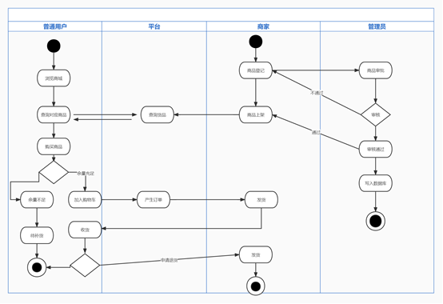

# 基于推荐算法开发商城交易网站

## 软件需求说明书
__项目名称：
&emsp;基于推荐算法开发商城交易网站&emsp;__

**招标编号：
&emsp;&emsp;&emsp;WYYD20220913001&emsp;&emsp;&emsp;&emsp;**

**招标机构：
&emsp;无言以对电子商务有限公司&emsp;&emsp;&emsp;**

**招标日期：
&nbsp;&ensp;&ensp;2022&ensp;&ensp;&ensp;年
&nbsp;&emsp;09&emsp;&nbsp;月
&emsp;&nbsp;20&emsp;&nbsp;日**
#

---
##### 首部
* 项目名称：小型线上购物平台
* 项目标识：20220913
* version：1.0.0
* 状态与版本信息
    * 文件状态：编写完成
    * 文件标识：Requirements20220913
    * 当前版本：1.0.0
    * 作者
        * 姓名：蒋博蓝 尚昕
        * 学号：2019012245 2019011305
        * 团队：无言以队软件需求说明书小组
    * 完成日期：2022年9月26日
    * 版本更新信息：https://github.com/nopac/SE-Demo
* 引言
    * 使用人员: 参加该项目的所有开发人员、需求分析人员、甲方负责人。
    * 编写目的: 记录本项目的使用需求，使开发人员更加清晰的认识该项目的所有需求，方便之后的开发工作的进行。
    * 背景
    * 定义与缩写
        * 接口
            * 接口:指外部系统与系统之间以及内部各子系统之间的交互点。分为外部接口、内部接口，内部接口又包括：上层服务与下层服务接口、同级接口
        * http
            * 是www服务器传输超文本向本地浏览器的传输协议。
    * 参考资料
        * 资料一
        * 资料二
        * 资料三

---
## 一、任务概述
### 1、目标
实现基于推荐算法的网上交易平台
* 项目目标
* 基本目标：实现一个线上交易平台
* 项目功能包括:卖家上架、售卖商品、发货、提供售后服务
* 买家浏览商城、加购商品、下单、付款、收货、售后
* 管理员审核注册人员信息和商品信息
* 附加要求：利用推荐算法，针对买家个性化推荐商品。
### 2、用户特点
本项目致力为对线上交易存在需求的用户群体提供一个稳定的交易平台。用户通过注册可成为卖家或买家，购买或售卖自己心仪的商品。同时本平台也会基于智能算法，针对向分析买家行为，根据行为结果为买家推荐其可能需求的产品。
### 3、应用环境
* Windows、Linux
### 4、假定和约束
#### 软件约束
平台基于SpringBoot进行开发，开发运行环境为：
* 前端
  * vue+element-plus
* 后端
    * Springboot+Mybatis-plus
    * 数据库
    * MySQl
#### 时间约束
* 系统应在11月初前完成
## 二、需求规定
### 1、对功能规定
#### 功能管理
* 买家注册登录: 用户通过平台给出的需求信息进行注册
* 卖家注册:买家通过上传营业执照等方式，完成商家注册
* 卖家上架、售卖商品、发货、提供售后服务
* 买家浏览商城、加购商品、下单、付款、收货、售后
* 管理员审核注册人员信息和商品信息
#### 平台管理
* 平台分析用户行为，为用户推送可能符合喜好的产品
#### 业务流程
* 核心功能状态图：

#### 数据字典

---

| 表名  | 实现功能 |
|-----|------|
|user_sys | 用户表|
|merchant_sys| 商家表|
|goods|商品表|
| cart |购物车表|
|charge|用户充值记录表|
 |comment | 用户评论表|
| file_sys | 文件表|
| goodsimage  |  商品图片表|
| orderuser  |  用户订单表|
|platmoney |平台账户表|
|platwater |平台流水记录表|
---

### 3、对性能规定
#### 精度:
* 数据精度：64bit
#### 时间特性要求:
* 系统响应时间:根据网速而定
* 模块组合时间:根据网速而定,通常情况1秒
#### 灵活性：
* 系统界面设计友好、操作方便、灵活；
* 拥有高可靠性和容错能力,严防系统在用户交易期间发生故障和错误
* 卖家和买家可以方便统计当前的流水数据
### 4、输入输出需求
#### 输入需求：
  * 需要输入用户的基础信息，包括字符串型用户名、字符串型用户密码、字符串型用户的收货地址；
  * 需要输入商家的基础信息，包括字符串型商家名、字符串型商家密码、字符串型商家发货地址、图片格式的商家的营业许可证、商家所销售的商品；
  * 需要输入商品的基础信息，包括字符串型商品种类、一维数组型商品编号、字符串型商品的款式、一维数组型商品的库存、一维数组型商品的销量、一维数组型商品的价格、字符串型商品的质量检测结果、字符串型商品的名称、图片格式的商品的图片；
  * 需要输入管理员的基础信息，包括字符串型管理员的名称、字符串型管理员的密码、一维数组型管理员的联系方式；
#### 输出需求：
  * 需要输出用户的购买记录、购物车表、一维数组型用户充值金额、一维数组型用户账户余额、用户的购买历史表、用户的评论记录表；
  * 需要输出商家申请上架商品的申请表、用户申请商家资格的申请表、项目中所有的交易记录表；
### 5、数据管理能力要求
  * 因为本平台为线上购物平台，涉及到金钱与物品的交易，因此对于每一笔交易必须进行即时的存储，且每一笔交易的状态要进行长期的存储，以免交易出现问题时可即时高效的进行处理解决，以此提高平台的安全性。
  * 用户在该平台进行虚拟充值，则系统对于每一个用户的信息必须具有较高的隐秘性存储，必须保证用户信息不被泄露，尽可能地控制用户信息的管理权限。
  * 商品的基础信息由商家全权管理，但商品的上架与下架必须由管理员审核通过，因此商品信息的管理权限相较于用户信息较宽松。
  * 由于该项目是购物平台，则存在同一时间数以百计的用户同时在线使用，或者同一时间进行对数交易，因此该项目的数据存储功能必须高速且敏捷。
### 6、故障处理要求
  * 当软件发生故障时，首先要求服务器立即停止工作，暂停所有正在进行的交易，提示用户系统正在维护无法进行交易。
  * 接着系统维护人员必须尽快进行问题检索，尽可能快的找出故障所在，并与开发人人员紧急会议，讨论故障如何解决，并且在解决故障的同时检查其他模块，减少故障再次出现的可能。
  * 当故障排除，且检查完善好整个系统后，服务器再次开放，系统重新运作。
  * 管理员收集排查在故障发生时用户使用时产生的问题，维护人员针对产生的问题给出解决措施，无法解决的则进行相关的赔偿。
  
### 7、其他专门要求
## 三、运行环境规定
### 1、设备
  * 该软件支持PC端设备使用。
  * i5以上处理器，16GB运行内存的设备。
### 2、支持软件
  * 支持32位、或64位windows操作系统
  * 支持IDEA或eclipse编译程序
  * 支持loadrunner、IDEA等测试软件
  * 该软件支持最新版IE浏览器、谷歌浏览器、微软浏览器、360浏览器使用
### 3、接口
  * 使用http或者https类型的服务器与客户端接口；
  * 使用socket类型的多线程接口；
### 4、控制
  * 控制项目运行的方法是实时控制；
  * 控制信号是连续信号；
  * 控制信息来源于服务器的提交数据。
  

#
#

需求方（签字/盖章）：&emsp; &emsp; &emsp; &emsp; &emsp; &emsp; &emsp; &emsp; &emsp;开发方（签字/盖章）：

#
#

&nbsp;2022&ensp;年
&nbsp;09&nbsp;月
&nbsp;20&nbsp;日
&emsp; &emsp; &emsp; &emsp; &emsp; &emsp; &emsp; &emsp; &emsp;
&nbsp;2022&ensp;年
&nbsp;09&nbsp;月
&nbsp;20&nbsp;日

#
#
## 四、附件