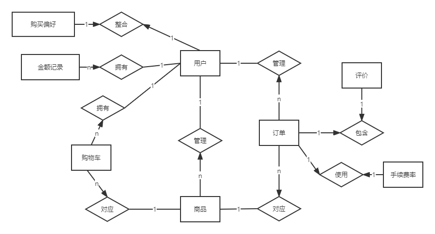

# 详细设计说明书
## 状态与版本信息
## 引言

#
## 一、程序的系统结构
### （一）单元设计说明
#### 1. 用户
##### XXX程序描述：
|功能|性能|输入说明|输出说明|算法|接口|存储分配|
|:---|:---|:---|:---|:---|:---|:---|
|浏览商品|响应时间：系统用户的网络，一般正常网络响应时间不超过1s。更新时间：秒级|前端网页地址|暂无|GoodsService|GoodsDao|前端存储：商品信息 后端存储：商品列表，人员列表
##### 注释设计：
 - 用户状态：未登录状态和已登录状态。

 - 首页展示：已登录状态下商品展示界面向用户展示的是基于推荐算法过滤后的商品，有利于用户的浏览体验。

 - 用户操作：未登录情况下只能浏览和查看商品属性，不能进行购买等其他操作。

 - 商品:对应属性下显示对应商品。
##### 测试条件：
 - 浏览的商城首页位置为\Home

 - 商城首页显示已有商品信息：包括商品图片和商品价格等

 - 首页上方的搜索栏目输入指定属性可以搜索到对应商品
##### 流程逻辑：
 - 例如用户进入商城首页，商城首页界面向用户展示的是数据库中已存在的商品。用户可以点击商品图片查看商品详细信息。
   
 - 未登录状态下用户不能将商品加入购物车或者进行购买。
   
 - 未登录状态下和已登录状态下都可以进行商品搜索操作。
##### 尚未解决的问题：
 - 未登录状态下向用户展示的是下单或者收藏量高的近期爆款商品
#
##### XXX程序描述：
|功能|性能|输入说明|输出说明|算法|接口|存储分配|
|:---|:---|:---|:---|:---|:---|:---|
|搜索商品|响应时间：系统用户的网络，一般正常网络响应时间不超过1s。更新时间：秒级|前端网页地址|暂无|GoodsService|GoodsDao|前端存储：商品信息 后端存储：商品列表，人员列表
##### 注释设计：
- 用户状态：未登录状态和已登录状态。

- 首页展示：已登录状态下商品展示界面向用户展示的是基于推荐算法过滤后的商品，有利于用户的浏览体验。

- 用户操作：未登录情况下只能浏览和查看商品属性，不能进行购买等其他操作，输入商品属性或者名称进行搜索。

- 商品:对应属性下显示对应商品。
##### 测试条件：
- 浏览的商城首页位置为\Home

- 商城首页显示已有商品信息：包括商品图片和商品价格等

- 首页上方的搜索栏目输入指定属性可以搜索到对应商品
##### 流程逻辑：
- 例如用户进入商城首页，商城首页界面向用户展示的是数据库中已存在的商品。用户可以点击商品图片查看商品详细信息。

- 未登录状态下用户不能将商品加入购物车或者进行购买。

- 未登录状态下和已登录状态下都可以进行商品搜索操作。
##### 尚未解决的问题：
- 可以在搜索功能里加入分类搜索，例如点击家电进入家电专区。

##### XXX程序描述：
|功能|性能|输入说明|输出说明|算法|接口|存储分配|
|:---|:---|:---|:---|:---|:---|:---|
|用户注册|响应时间：系统用户的网络，一般正常网络响应时间不超过1s。更新时间：秒级|输入指定格式的用户名,不得超过指定长度，不得使用非法字符|生成用户指定的id|UserController,UserService|UserDao|前端存储：用户注册信息，后端存储：用户表
##### 注释设计：
 - 该用户名是否已经被注册，已注册的用户名需重新选择

 - 用户名需符合指定格式，指定长度且不得使用非法字符

 - 密码需符合指定格式，指定长度且不得使用非法字符

 - 填写正确格式的验证码
##### 测试条件：
 - 注册的vue页面位置是/register

 - 用户用户名为未注册过的合法格式

 - 密码为符合格式没有非法字符的字符串

 - 验证码输入正确

  
##### 流程逻辑：
 - 用户进入商城首页，点击头像进行登录操作。然后进入登录界面点击注册进入注册页面，输入正确的用户名和密码，输入验证码进行注册
   
 - 此操作结束后会往后台数据库user表中插入一条用户信息。
   
 - 用户返回登录界面用注册的账户进行登录。
##### 尚未解决的问题：
 - 用户名可以重复，userid唯一也能注册成功

##### XXX程序描述：
|功能|性能|输入说明|输出说明|算法|接口|存储分配|
|:---|:---|:---|:---|:---|:---|:---|
|登录功能|响应时间：系统用户的网络，一般正常网络响应时间不超过1s。更新时间：秒级|用户名，密码|登录成功并进入商城首页|UserService|UserDao|前端：用户信息 后端：用户列表。商品列表
##### 注释设计：
 - 请输入合适的用户名
   
 - 请输入正确的密码
   
 - 请输入正确的验证码

##### 测试条件：
 - 登录的vue页面位置为\login。

 - 用户名为注册过的用户名。

 - 密码为该用户名所对应的正确的密码格式。

##### 流程逻辑：
 - 用户进入商城首页点击头像进行登录，进入登录页面输入注册过的账号密码进行登录，此时当后台数据库有当前的user用户信息，则就可以登录成功。
##### 尚未解决的问题：
 - 暂无

##### XXX程序描述：
|功能|性能|输入说明|输出说明|算法|接口|存储分配|
|:---|:---|:---|:---|:---|:---|:---|
||||||
##### 注释设计：
 -  1.
    2.
    3.
##### 测试条件：
 -  1.
    2.
    3.
##### 流程逻辑：
 -  1.
    2.
    3.
##### 尚未解决的问题：
 -  1.
    2.
    3.

##### XXX程序描述：
|功能|性能|输入说明|输出说明|算法|接口|存储分配|
|:---|:---|:---|:---|:---|:---|:---|
||||||
##### 注释设计：
-  1.
   2.
   3.
##### 测试条件：
-  1.
   2.
   3.
##### 流程逻辑：
-  1.
   2.
   3.
##### 尚未解决的问题：
-  1.
   2.
   3.

##

#### 2. 商家
##### XXX程序描述：
|功能|性能|输入说明|输出说明|算法|接口|存储分配|
|:---|:---|:---|:---|:---|:---|:---|
||||||
##### 注释设计：
##### 测试条件：
##### 流程逻辑：
##### 尚未解决的问题：

#
##### XXX程序描述：
|功能|性能|输入说明|输出说明|算法|接口|存储分配|
|:---|:---|:---|:---|:---|:---|:---|
||||||
##### 注释设计：
##### 测试条件：
##### 流程逻辑：
##### 尚未解决的问题：

#
#### 3. 管理员
##### XXX程序描述：
|功能|性能|输入说明|输出说明|算法|接口|存储分配|
|:---|:---|:---|:---|:---|:---|:---|
||||||
##### 注释设计：
##### 测试条件：
##### 流程逻辑：
##### 尚未解决的问题：

#
##### XXX程序描述：
|功能|性能|输入说明|输出说明|算法|接口|存储分配|
|:---|:---|:---|:---|:---|:---|:---|
||||||
##### 注释设计：
##### 测试条件：
##### 流程逻辑：
##### 尚未解决的问题：

#
### （二）数据库设计

#### 1. 外部设计
##### 1). 标准描述方式
###### (1) 标志符和状态

|  表名   | 名称  |  描述信息   | 状态  |
|  ----  | ----  |  ----  | ----  |
| 用户表  | User | 用户(普通用户和商户)信息  | 使用状态 |
| 商品表  | Goods | 商品信息  | 使用状态 | 
| 订单表  | Orders | 订单信息  | 使用状态 |
| 购物车表  | cart | 用户购物车信息  | 使用状态 |
| 评论表  | review | 用户商户双向评价打分  | 使用状态 |
| 金额记录表  | AmountRecord | 用户充值支出记录  | 使用状态 |       
| 管理员表  | Asministrators | 管理员账户信息  | 使用状态 |  
| 浏览记录表  | BrowseRecord | 用户浏览商品信息  | 未使用状态 |  

###### (2) 使用它的程序

|  应用程序   | 名称  |  版本号   |
|  ----  | ----  |  ----  |
| 注册登录与信息管理  | 一般用户模块 | 1.0  |
|  订单管理 | 一般用户模块 | 1.0  |
| 商品管理  | 商户模块 | 1.0  |
| 商家订单管理  | 商户模块 | 1.0  |
| 用户管理后台系统  | 管理员模块 | 1.0  |
| 商品和商家管理后台系统  | 管理员模块 | 1.0  |
| 审查后台系统  | 管理员模块 | 1.0  |

###### (3) 约定

* 1 用户表  (User) 

|  前缀   | 说明  |
|  ----  | ----  |
|Uid  | 商户id | 
|Uname  | 姓名 | 
|Upsw  | 密码 | 
|Phone  | 手机号 | 
|Email  | 邮箱 | 
|City  | 城市 | 
|Sex  | 性别 | 
|Bank  | 银行账号 | 
|Account  | 余额 | 
|Point  | 积分 | 
|Status  | 状态 | 
|License  | 营业执照 | 
|Identity  | 身份证 | 
|Grade  | 商家等级 | 
|Turnover  | 总交易额 | 
|LikeRate  | 满意度 | 
|MLikeRate  | 商家好评率 | 
|isMerchant  | 是否为商家 | 
|IdentityNumber  | 身份证号 | 
|Address  | 地址 | 

* 2 商品表 (Goods) 

|  前缀   | 说明  |
|  ----  | ----  |
|Gid  | 商品id | 
|Gname  | 商品名称 | 
|type  | 类别 | 
|Price  | 价格 | 
|Size  | 尺寸大小 | 
|Picture  | 照片 | 
|Introduction  | 使用说明 | 
|Bargain  | 是否允许议价 | 
|Storage  | 商品数量 | 
|GCondition  | 新旧程度 | 
|Mid  | 发布人 | 
|RNumber  | 评价数 | 
|Sale  | 销售量 | 
|likeRate  | 好评率 | 
|Status  | 状态 | 

* 3 订单表 (Orders)  

|  前缀   | 说明  |
|  ----  | ----  |
|Oid  | 订单id | 
|Uid  | 用户 | 
|Gid  | 商品 | 
|Mid  | 商家 | 
|Rid  | 评价 | 
|Subtime  |    提交时间  | 
|SubSucTime  | 成交时间 | 
|SentTime  |   发货时间  | 
|Price  | 单价 | 
|RetTime  | 退货时间 | 
|RetSecTime  | 退货成功时间 | 
|status  | 状态 | 
|Commission  | 手续费 | 
|Address  | 地址 | 
|Number  |  数量| 
|DeliverID  | 快递单号 | 
|sum  |   总金额| 
|Gname  | 商品名 | 
|MNote  | 商家备注 | 

* 4 购物车表 (cart) 

|  前缀   | 说明  |
|  ----  | ----  |
| Cid| 购物车id | 
| Uid| 用户 | 
| Gid| 商品 | 
| Number|个数 | 
| Price| 单价| 
| Gname| 名称| 

* 5 评论表 (review)

|  前缀   | 说明  |
|  ----  | ----  |
| Rid | 评价id | 
| star | 星级  | 
| Remark | 文字 | 
| Time | 评价时间 | 
| Fromid | 评价者 | 
| Toid | 被评价者 | 
| Rate | 被评价者满意度 | 
| type | 类型 | 
| oid | 订单 | 

* 6 金额记录表 (AmountRecord)

|  前缀   | 说明  |
|  ----  | ----  |
| Aid | 金额记录id | 
| Type |   类型 | 
| Amount | 金额 | 
| Atime |  时间 | 
| Oid |    订单 | 
| Uid |    用户  | 
| Account |余额   | 

* 7 管理员表 (Asministrators)

|  前缀   | 说明  |
|  ----  | ----  |
| AdmID | 管理员id | 
| password | 管理员密码 | 

* 8 浏览信息表 (BrowseRecord)

|  前缀   | 说明  |
|  ----  | ----  |
| Bid | 浏览信息表的id | 
| Uid | 用户id | 
| GoodsType | 商品类型 | 
| BrowseCount | 浏览次数 | 

###### (4) 专门指导
可参考的资料：
* 软件工程哈工大耿建玲视频
* 数据库设计规范

###### (5) 支持软件

1. 数据库设计编辑工具“navicat for mysql”
2. 数据库自带工具“mysql command line client”
3. 管理员工具：navicat for mysql

##### 2). 自由表述
暂无

#### 2.结构设计

##### 1) 概念设计

###### (1) 数据实体E-R图

用户

###### (2) 数据实体描述

| 数据实体名称 | 数据库表名     | 数据实体描述             |
| ------------ | -------------- | ------------------------ |
| 用户         | User           | 用户信息                 |
| 商品         | Goods          | 商品信息                 |
| 订单         | Orders         | 订单信息                 |
| 评价         | Review         | 评价信息                 |
| 购物车       | Cart           | 购物车信息               |
| 金额记录     | AmountRecord   | 金额变动记录             |
| 购买偏好     |                |                          |
| 手续费率     | Commissionrate | 商家等级所对应的手续费率 |

###### (3) 实体关系描述

1. 用户：商品（1：n）
   关系描述：一位商家可以发布多个商品并进行管理；

2. 用户：金额记录（1：n）
   关系描述：一位用户的金额变动记录会有多条；

3. 用户：购买偏好（1：1）
   关系描述：一位用户的购买次数和浏览次数统计只有一条记录；

4. 用户：购物车（1：n）
   关系描述：一位用户可以拥有多条购物车记录；

5. 用户：订单（1：n）
   关系描述：一位用户可以拥有多条订单记录；

6. 商品：订单（1：n）
   关系描述：一个商品可以在订单表中拥有多条记录；

7. 商品：购物车（1：n）
   关系描述：一个商品可以在购物车中存在多条记录；

8. 订单：评价（1：1）
   关系描述：一个订单只能评价一次；

9. 订单：手续费（1：1）

   关系描述：一个订单需要使用手续费率表里面的一条记录。

##### 2) 逻辑结构设计

1. Users（<u>Uid</u>，用户名，密码，余额，积分，营业执照，身份证，商家等级，满意度，商家好评率，营业额）

2. Goods（<u>Gid</u>，类型，价格，库存，好评率，照片，说明，状态，新旧程度，发布人，销量）

3. Orders（<u>Oid</u>，Uid，Gid，Rid，单价，提交时间，成交时间，发货时间，退货时间，退货成功时间，状态，手续费，总金额，商家备注，快递单号，地址，数量）

4. Review（<u>Rid</u>，星级，文字，评价时间，评价者，被评价者，被评价者满意度，类型，Oid）

5. AmountRecord（<u>Aid</u>，类型，金额，时间，Oid，Uid，余额）

6. Cart（<u>Cid</u>，Uid，Gid，数量，单价，名称）

7. Browse

8. Commission

##### 3) 物理设计

* 数据库名称：se-demo
* 存储位置：为了提高系统性能，应根据应用情况将数据的易变部分与稳定部分、经常存取部分和存取频率较低部分分开存放；
* 存取方法：采用Hash索引存储方法；
* 系统配置：关系数据库管理系统产品一般都提供了一些系统配置变量和存储分配参数，供设计人员和数据库管理员对数据库进行物理优化。

#### 3. 运行设计

##### 1) 数据字典设计

###### 用户

| 数据项编号 | 数据项名   | 别名           | 存储结构     |
| ---------- | ---------- | -------------- | ------------ |
| 001        | 用户id     | Uid            | int          |
| 002        | 用户姓名   | Uname          | varchar(45)  |
| 003        | 密码       | Upsw           | varchar(45)  |
| 004        | 手机号码   | Phone          | varchar(45)  |
| 005        | 电子邮件   | email          | varchar(45)  |
| 006        | 城市       | City           | varchar(45)  |
| 007        | 性别       | Sex            | int          |
| 008        | 银行账号   | Bank           | varchar(45)  |
| 009        | 余额       | Account        | double       |
| 010        | 积分       | Point          | int          |
| 011        | 状态       | Status         | int          |
| 012        | 营业执照   | License        | varchar(255) |
| 013        | 身份证     | Identity       | varchar(255) |
| 014        | 等级       | Grade          | int          |
| 015        | 总交易额   | Turnover       | double       |
| 016        | 满意度     | LikeRate       | double       |
| 017        | 商家满意度 | MLikeRate      | double       |
| 018        | 是否为商家 | isMerchant     | int          |
| 019        | 身份证号   | IdentityNumber | varchar(45)  |
| 020        | 地址       | Address        | varchar(45)  |

###### 商品

| 数据项编号 | 数据项名     | 别名         | 存储结构     |
| ---------- | ------------ | ------------ | ------------ |
| 021        | 商品id       | Gid          | int          |
| 022        | 商品名称     | Gname        | varchar(45)  |
| 023        | 商品类型     | type         | varchar(45)  |
| 024        | 商品价格     | Price        | double       |
| 025        | 尺寸大小     | Size         | varchar(45)  |
| 026        | 商品图片     | Picture      | varchar(255) |
| 027        | 使用说明     | Introduction | varchar(45)  |
| 028        | 是否允许仪价 | Bargain      | tinyint      |
| 029        | 商品数量     | Storage      | int          |
| 030        | 新旧程度     | GCondition   | varchar(45)  |
| 031        | 发布人       | Mid          | int          |
| 032        | 评价数       | RNumber      | int          |
| 033        | 销售量       | Sale         | int          |
| 034        | 好评率       | likeRate     | double       |
| 035        | 状态         | Status       | int          |

###### 订单

|数据项编号 | 数据项名 |别名|储存结构|
|-----|-----|-----|-----|
|036|订单编号|Oid|int|
|037|用户编号|Uid|int|
|038|商品编号|Gid|int|
|039|商家编号|Mid|int|
|040|评价|Rid|int|
|041|提交时间|Subtime|datetime|
|042|成交时间|SubSucTime|datetime|
|043|发货时间|SentTime|datetime|
|044|单价|Price|double|
|045|退货时间|RetTime|datetime|
|046|退货成功时间|RetSecTime|datetime|
|047|状态|status|int|
|048|手续费|Commission|double|
|049|地址|Address|varchar(45)|
|050|数量|Number|int|
|051|快递单号|DeliverID|varchar(45)|
|052|总金额|sum|double|
|053|商品名|Gname|varchar(45)|
|054|商家备注|MNote|varchar(45)|

###### 评价信息

|数据项编号 | 数据项名 |别名| 储存结构 |
|-----|-----|-----|---|
| 055 | 评价编号 |Rid|int|
|056|星级|star|int|
|057|文字|Remark|varchar(45)|
|058|评价时间|Time|datetime|
|059|评价者|Fromid| int         |
|060|被评价者|Toid| int |
|061|被评价者满意度|Rate| double |
|062|类型|type| int |
|063|订单|oid| int |

###### 购物车

|数据项编号 | 数据项名 |别名| 储存结构 |
|-----|-----|-----|---|
|064| 购物车编号|Cid|int|
|065|用户编号|Uid|int|
|066|商品编号|Gid|int|
|067|个数|Number|int|
|068|单价|Price|double|
|069|名称|Gname|varchar(45)|

###### 金额记录

|数据项编号 | 数据项名 |别名| 储存结构 |
|-----|-----|-----|---|
|070|记录编号|Aid|int|
|071|类型|Type| tinyint |
|072|金额|Amount|double|
|073|时间|Atime|datetime|
|074|订单编号|Oid|int|
|075|用户编号|Uid|int|
|076|金额|Account|double|

###### 管理员

|数据项编号 | 数据项名 |别名| 储存结构 |
|-----|-----|-----|---|
|077|管理员编号|AdmID|int|
|078|管理员密码|password|varchar(45)|

###### 手续费率

| 数据项编号 | 数据项名     | 别名  | 储存结构 |
| ---------- | ------------ | ----- | -------- |
| 079        | 手续费率编号 | id    | int      |
| 080        | 商家等级     | Grade | int      |
| 081        | 手续费率     | Rate  | double   |

##### 2) 安全保密设计

系统的管理权限如下

|              | 用户 | 商家 | 管理员 |
| ------------ | ---- | ---- | ------ |
| 商品管理     |      | √    | √      |
| 用户管理     |      |      | √      |
| 商家管理     |      |      | √      |
| 订单管理     | √    | √    |        |
| 评价管理     | √    | √    |        |
| 金额记录管理 | √    | √    |        |
| 购物车管理   | √    | √    |        |

